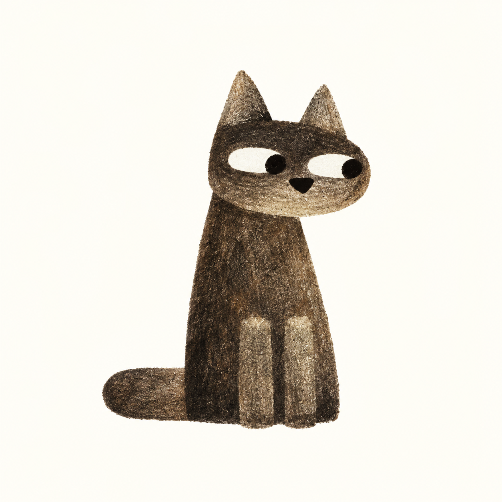

<div align="center">
  

  # Mac Duo

  在 MacBook 合盖时，为屏幕画面添加倾斜、模糊和渐暗效果。
</div>

## 功能

- 读取 MacBook 屏幕开合角度，自动触发动画
- 使用 Metal 实时渲染透视、模糊和渐暗效果
- 使用 ScreenCaptureKit 捕获内置屏幕画面
- 可在菜单栏调整触发角度、视觉强度和登录启动等选项
- 可临时隐藏菜单栏图标，再次打开应用即可恢复
- 完整简体中文界面

## 使用要求

- macOS 14 或更高版本
- 带有屏幕开合角度传感器的 MacBook
- “屏幕与系统录音”权限

> 仅内置屏幕支持此效果。并非所有 MacBook 机型都配有兼容的角度传感器。

## 快速开始

需要安装 Xcode，并确保 Swift 版本不低于 6.0。

```bash
git clone https://github.com/mraz2766/mac_duo.git
cd mac_duo
./build.sh --run
```

首次启动时，请按提示为 Mac Duo 开启“屏幕与系统录音”权限。应用启动后会显示在菜单栏中。

## 安装

构建完成后，应用位于 `build/Mac Duo.app`。将它拖入“应用程序”文件夹即可安装。

```bash
./build.sh
```

默认使用临时签名。若需要使用自己的签名身份：

```bash
SIGN_IDENTITY="你的签名身份" ./build.sh
```

同时构建 Apple 芯片与 Intel 版本：

```bash
./build.sh --universal
```

## 使用说明

1. 点击菜单栏中的猫咪图标。
2. 开启“景深效果”，按需调整触发角度和视觉参数。
3. 缓慢合上 MacBook 屏幕以触发效果。

默认设置适合从 MacBook 正前方观看。菜单栏中的“实时渲染”关闭后，效果会保持触发瞬间的画面。

点击“隐藏菜单栏图标”可以在本次运行中收起图标。需要恢复时，从 Finder、Spotlight 或“应用程序”文件夹再次打开 Mac Duo；恢复后如需隐藏，请重新点击该按钮。

## 常见问题

### 没有出现效果

确认应用拥有“屏幕与系统录音”权限，并检查菜单中是否显示传感器不可用。重新构建采用临时签名的应用后，macOS 可能要求再次授权。

### 外接显示器没有效果

当前版本只处理 MacBook 的内置屏幕。

### 合盖到最后时效果停止

这是 macOS 进入睡眠后的系统行为。

## 开发

项目使用 Swift Package Manager 管理，包含以下目标：

- `MacDuo`：菜单栏应用
- `LidAngleKit`：屏幕开合角度传感器封装
- `lidprobe`：传感器诊断工具，构建后位于 `build/lidprobe`

仅编译 Swift 软件包：

```bash
swift build
```

## 致谢与许可

项目原版由 [Makito](https://github.com/sumimakito) 开发，并使用 AI 辅助构建。

本项目采用 [Apache License 2.0](LICENSE) 许可，署名信息见 [NOTICE](NOTICE)。
